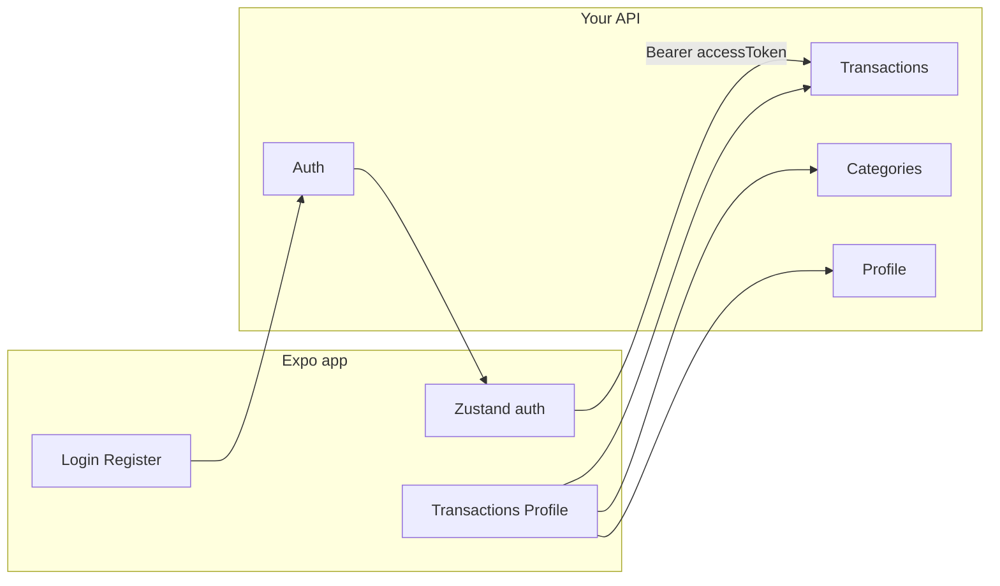

# API documentation (from Kodi UI)

## Current integration reality

- **Custom HTTP**: Not implemented. `[login.tsx](<app/(auth)`/login.tsx>) and `[register.tsx](<app/(auth)`/register.tsx>) only `console.log` on submit.
- **Supabase Auth**: Used for **forgot password** (`resetPasswordForEmail`) and **reset password** (`setSession` + `updateUser`) in `[forgot-password.tsx](<app/(auth)`/forgot-password.tsx>) and `[reset-password.tsx](<app/(auth)`/reset-password.tsx>). Deep link target: `reset-password` via `Linking.createURL`.
- **App auth gate**: `[app/_layout.tsx](app/_layout.tsx)` uses `useAuthStore().isAuthenticated` to route between `(auth)` and `(tabs)`.
- **Expected token shape** (for when you wire login): `[types/auth.ts](types/auth.ts)` — see **Auth** below.
- **Currency**: Amounts in UI use **NGN** (`[lib/custom.ts](lib/custom.ts)`, income preview in `[add-income.tsx](app/add-income.tsx)`).

---

## Authentication and session

### Token + user (Zustand contract)

After successful login/register, the client will likely call `login(tokens, user)` on the store with:

`**AuthTokens`

- `accessToken`: string (JWT)
- `refreshToken`: string
- `tokenType`: string (e.g. `"Bearer"`)
- `expiresIn`: number (seconds)
- `passwordChangeRequired`: boolean

`**User`

- `id`: string
- `name`: string
- `email`: string

**JWT expectations** (helper in `[lib/jwt-decode.ts](lib/jwt-decode.ts)`): standard `exp`; optional custom claims `userId`, `role`.

### Suggested REST endpoints (custom backend)

| Action                    | Request body (from UI)                                        | Notes                                                                      |
| ------------------------- | ------------------------------------------------------------- | -------------------------------------------------------------------------- |
| **POST** `/auth/login`    | `{ "email": string, "password": string }`                     | `[login.tsx](<app/(auth)`/login.tsx>) — Yup email + password               |
| **POST** `/auth/register` | `{ "fullName": string, "email": string, "password": string }` | `[register.tsx](<app/(auth)`/register.tsx>) — confirm password client-only |
| **POST** `/auth/refresh`  | `{ "refreshToken": string }`                                  | Matches `AuthTokens.refreshToken`                                          |
| **POST** `/auth/logout`   | optional                                                      | Invalidate refresh token server-side if you use rotation                   |

**Response** (login/register/refresh): include both `AuthTokens` and `User` (or fields the client maps into them).

**Google sign-in**: Button present but **no handler** — if you add it, standard OAuth token exchange endpoint is implied.

### Logged-in password change

`[features/profile/change-password-screen.tsx](features/profile/change-password-screen.tsx)` collects:

- `currentPassword`, `newPassword` (min 8), `confirmPassword`

**POST** `/auth/change-password` (authenticated): `{ "currentPassword": string, "newPassword": string }`

### Forgot / reset password

Today this is **Supabase**, not your API. If you move to custom backend:

- **POST** `/auth/forgot-password` `{ "email": string }` → send email with link containing tokens or one-time code.
- **POST** `/auth/reset-password` `{ "token": string, "newPassword": string }` (or session-based flow mirroring Supabase).

---

## User profile

`[features/profile/edit-profile-screen.tsx](features/profile/edit-profile-screen.tsx)`

**Fields**

- `fullName`, `email`, `phone`, `username` (required in Yup)
- `bio` (optional string)
- Avatar: local image URI from picker — API should accept **multipart upload** or **presigned URL** + final `avatarUrl`

**Suggested**

- **GET** `/me` → profile + settings the app needs
- **PATCH** `/me` → JSON body for text fields
- **POST** `/me/avatar` → file or URL workflow

`[types/auth.ts](types/auth.ts)` `User` is minimal; extend server model with `phone`, `username`, `bio`, `avatarUrl` for the edit screen.

---

## Categories

**Expense categories** (built-in IDs used in UI): `food`, `transport`, `bills`, `shopping`, `entertainment`, `other` — `[add-expenses.tsx](app/add-expenses.tsx)`, `[edit-expense.tsx](app/edit-expense.tsx)`. Selecting **Other** navigates to `[new-category.tsx](app/new-category.tsx)`.

**Custom category** (`[new-category.tsx](app/new-category.tsx)`, `[edit-category.tsx](app/edit-category.tsx)`):

- `name`: string
- `icon`: Material icon name (string from fixed list in UI)
- `color`: hex string (from fixed swatches)

**Suggested**

- **GET** `/categories` — list user + system categories (`id`, `name`, `icon`, `color`, `type`: expense|income)
- **POST** `/categories` — create custom
- **PATCH** `/categories/:id` — edit (`[edit-category.tsx](app/edit-category.tsx)` passes `id` in params)

**Income category IDs** in `[add-income.tsx](app/add-income.tsx)`: `salary`, `freelance`, `business`, `investment`, `gift`, `other`.

---

## Income transactions

`[add-income.tsx](app/add-income.tsx)` Formik model:

| Field        | Type                                    | Rules                                                                   |
| ------------ | --------------------------------------- | ----------------------------------------------------------------------- |
| `amount`     | string (parsed number, commas stripped) | required, > 0                                                           |
| `sourceName` | string                                  | optional in schema (defaults to first category label)                   |
| `categoryId` | enum                                    | one of `salary`, `freelance`, `business`, `investment`, `gift`, `other` |
| `date`       | ISO date                                | required                                                                |
| `notes`      | string                                  | optional                                                                |

**POST** `/transactions/income` (or unified `/transactions` with `type: "income"`): send numeric `amount`, `categoryId`, `sourceName`, `recordedAt`, `notes`.

`[edit-income.tsx](app/edit-income.tsx)` params: `id`, `amount`, `incomeSource`, `date`, `notes`, `tag` (`Monthly` | `Bonus` | `One-time`). **PATCH** `/transactions/income/:id` should accept the same + optional `tag`.

---

## Expense transactions

`[add-expenses.tsx](app/add-expenses.tsx)` local state:

| Field              | Notes                                                                                                                       |
| ------------------ | --------------------------------------------------------------------------------------------------------------------------- |
| `amount`           | string → number                                                                                                             |
| `category`         | id from built-in list or new custom                                                                                         |
| `date`             | `Date`                                                                                                                      |
| `notes`            | string                                                                                                                      |
| `receiptUri`       | optional local image — upload to storage, store URL                                                                         |
| `selectedIncomeId` | UI mock links expense to an “income source” with `total` / `remaining` — implies **budget or allocation** per income stream |

**POST** `/transactions/expense`: `amount`, `categoryId`, `recordedAt`, `notes`, `receiptUrl?`, `incomeSourceId?` (if you implement the allocation model).

`[edit-expense.tsx](app/edit-expense.tsx)`: **PATCH** `/transactions/expense/:id` with same fields as params suggest.

---

## Transaction list, search, filters

`[app/(tabs)/transact.tsx](<app/(tabs)`/transact.tsx>) mock row shape:

- `id`, `title`, `subtitle`, `amount`, `isIncome`, `categoryId`, `recordedAt`, display `time`, `icon`, `iconBg`
- Tabs: **All** | **Income** | **Expense** | **Savings** (filter dimension — define what “Savings” means in your domain, e.g. category or tag)

`[transactions-filter-modal.tsx](components/transactions-filter-modal.tsx)` `**TransactionFilter`:

- `dateRange`: `today` | `this_week` | `this_month` | `custom`
- `customRange`: `{ start: Date, end: Date }` when custom
- `categoryIds`: subset of `food`, `transport`, `shopping`, `bills`, `entertainment`, `health`, `investment`
- `amountMin` / `amountMax`: **0 … 1_000_000** (UI slider; adjust server defaults if needed)

**GET** `/transactions` query params (example): `q`, `type`, `from`, `to`, `categoryIds`, `amountMin`, `amountMax`, `page`, `pageSize`.

---

## Home dashboard

`[app/(tabs)/index.tsx](<app/(tabs)`/index.tsx>) + `[features/home/](features/home/)`

- **Net worth** (single number), **trend** copy
- `[recent-transaction.tsx](features/home/recent-transaction.tsx)`: `RecentTransactionRow[]` — `id`, `title`, `subtitle`, `amount` (signed), `icon`
- `[chart.tsx](features/home/chart.tsx)`: time series as `number[]` for growth/projection tabs (normalized 0–1 in demo)

**GET** `/dashboard/summary` or split: net worth, recent transactions, chart series (with date range).

---

## Insights / report

`[app/(tabs)/report.tsx](<app/(tabs)`/report.tsx>) (Insights) uses static data today:

- Donut: slices `{ value, color, label }` (percentages sum to 100 in mock)
- Hero card: “saved” amount, expense totals, month comparison
- Text “observations”

**GET** `/insights` or `/reports/spending-by-category?from=&to=` returning category breakdown, savings delta, and optional AI-style observation strings.

---

## Errors and auth header

- Use **Bearer** `accessToken` on protected routes (align with `tokenType`).
- Return errors in a stable shape the client can map to Formik `setFieldError` (e.g. `{ "fieldErrors": { "email": "..." } }` + `message`).

---

## Mermaid: high-level data flow (target state)

---

## Optional next step in repo

Wire `[login.tsx](<app/(auth)`/login.tsx>) / `[register.tsx](<app/(auth)`/register.tsx>) to `POST /auth/login` and `POST /auth/register`, map JSON into `AuthTokens` + `User`, and call `useAuthStore.getState().login(...)`.
